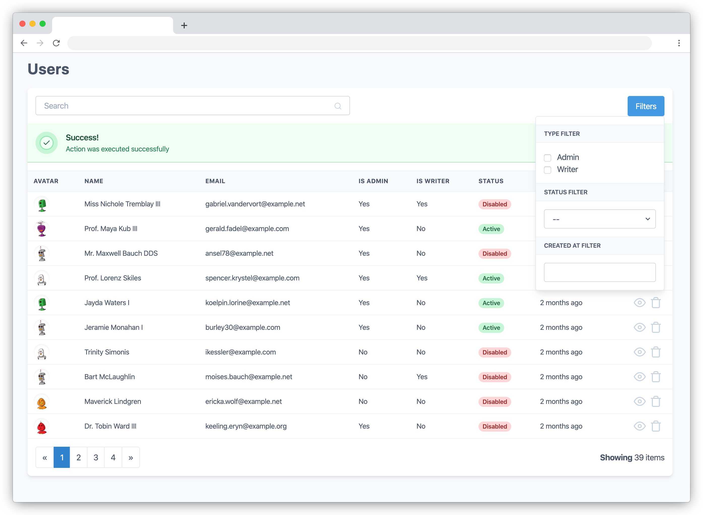

# Laravel views

Laravel package to create beautiful common views like tables using only PHP code, inspired by [Laravel Nova](https://nova.laravel.com/), these views are built with [Laravel Livewire](https://laravel-livewire.com/) and styled using [Tailwind CSS](https://tailwindcss.com/)

## Table View example



- [Installation and basic usage](#installation-and-basic-usage)
    - [Installing laravel views](#installing-laravel-views)
    - [Publishing assets](#publishing-assets)
    - [Including assets](#including-assets)
- [First table view](#first-table-view)
    - [Rendering the table view](#rendering-the-table-view)
- [Rendering a view](#rendering-a-view)
    - [From a controller](#from-a-controller)
    - [Specifying a layout and section](#specifying-a-layout-and-section)
    - [Send extra data](send-extra-data)
- [Components customization](#components-customization)
    - [Component variants using tailwindcss](#using-tailwindcss)
    - [Components full customization](#using-tailwindcss)

# Installation and basic usage

## Installing laravel views
```bash
composer require laravel-views/laravel-views
```

## Publishing assets
```bash
php artisan vendor:publish --tag=public --force
```
or you can specify the provider
```bash
php artisan vendor:publish --tag=public --provider='LaravelViews\LaravelViewsServiceProvider' --force
```

## Including assets
Add the following Blade directives in the *head* tag, and before the end *body* tag in your template
```blade
<html>
<head>
  ...
  @laravelViewsStyles
</head>
<body>
  ...
  @laravelViewsScripts
</body>
</html>
```
These blade directives are also including [Laravel livewire](https://laravel-livewire.com/) styles and scripts, after that maybe you will need to clear the view cache
```bash
php artisan view:clear
```

# First table view
This is a basic usage of a table view, you can [read the full table view documentation ](doc/table-view.md)


Once you have installed the package and included the assets you can start to create a basic table view.
```bash
php artisan make:table-view UsersTableView
```
With this artisan command a UsersTableView.php file will be created inside `app/Livewire` directory.

The basic usage needs a data repository (Eloquent query), headers and rows, you can customize the items to be showed, the headers and the data for each row like this example
```php
<?php

namespace App\Views;

use LaravelViews\Views\TableView;
use Illuminate\Database\Eloquent\Builder;
use App\User;

class UsersTableView extends TableView
{
    public function repository(): Builder
    {
        return User::query();
    }

    public function headers(): array
    {
        return ['Name', 'Email' 'Created', 'Updated'];
    }

    public function row($model)
    {
        return [$model->name, $model->email, $model->created_at, $model->updated_at];
    }
}
```

## Rendering the table view
The easiest way to render the view is using the facade directly with a blade file
```blade
{!! LaravelViews::create(App\Views\UsersTableView::class)->render() !!}
```

At this point you would be able to see a table with some data

In the exaple above the view is using the User model created by default in every Laravel project, feel free to use any model you have, the method `row` is receiving a sinlge model object and you can use any property or public method you have difined inside your model.

This is the basic usage of the table view, but you can customize it with more features.

[Read the full table view documentation ](doc/table-view.md)

# Rendering a view

## From a controller

The easiest way to render a view is using the facade directly on the blade file as the example above,
but it is a better practice if you inject a `LaravelViews` instance as a dependency in your controller.

```php
use use LaravelViews\LaravelViews;

public function index(LaravelViews $laravelViews)
{
    $laravelViews->create(App\Views\UsersTableView::class);

    return view('my-view', [
      'view' => $laravelViews
    ]);
}
```
And render it in your blade file
```blade
{!! $view->render() !!}
```

## Specifying a layout and section
You can also return the view directly from your controller and specify the layout and section of your layout
```php
use use LaravelViews\LaravelViews;

public function index(LaravelViews $laravelViews)
{
    $laravelViews->create(App\Views\UsersTableView::class)
      ->layout('layout', 'section-name');

    return $laravelViews->render();
}
```

## Send extra data
Same as you usually send data to your views, you can send more data to the layout file
```php
use use LaravelViews\LaravelViews;

public function index(LaravelViews $laravelViews)
{
    $laravelViews->create(App\Views\UsersTableView::class)
      ->layout('layout', 'section-name', [
        'title' => 'My layout title'
      ]);

    return $laravelViews->render();
}
```

# Components customization
These views are build with [Tailwind CSS](https://tailwindcss.com/) and you can either change the colors of the components following tailwindcss utilities or fully cutomize all the html of the components

## Component variants using tailwindcss
If you are using [Tailwind CSS](https://tailwindcss.com/) or you dont have problems handling Tailwindcss and your onw css styles You can customize some utilities to change the color for each variant of the components publishing a config file

```bash
php artisan vendor:publish --tag=config
```
or you can specify the provider
```bash
php artisan vendor:publish --tag=config --provider='LaravelViews\LaravelViewsServiceProvider'
```

Inside this config file you can change the colors for each component variant

## Components full customization

If you are not using taildwindcss, or you want to have a full cutomization over the html components, you can publish all the blade files used for these views.

```bash
php artisan vendor:publish --tag=views
```
or you can specify the provider
```bash
php artisan vendor:publish --tag=views --provider='LaravelViews\LaravelViewsServiceProvider'
```