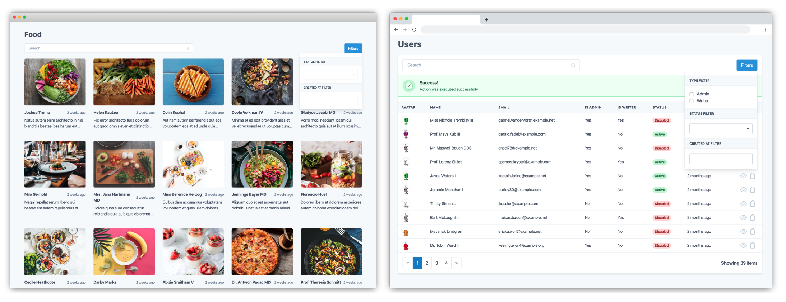
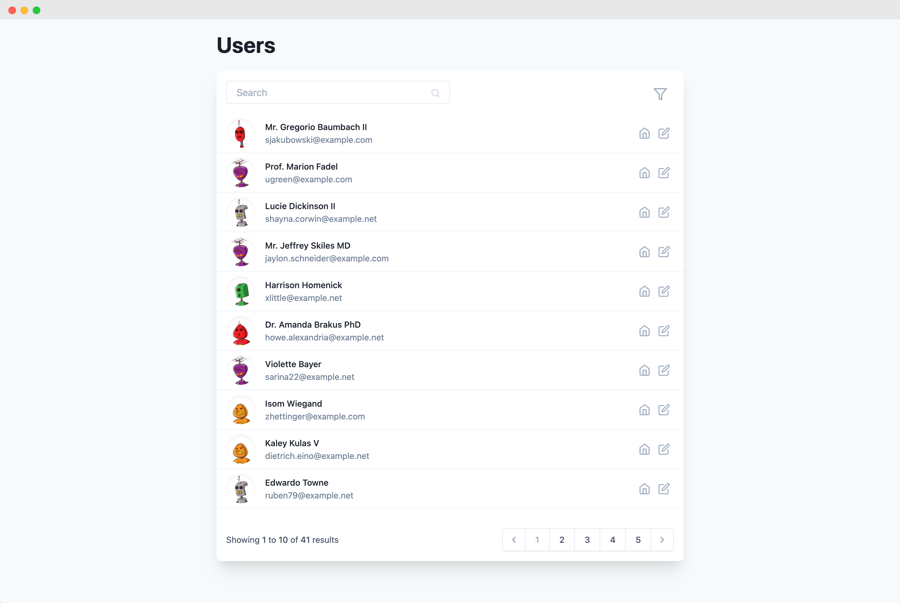
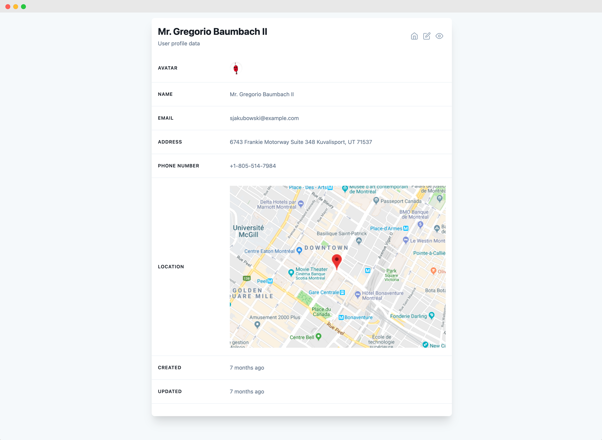

# Laravel views

[See live example](https://laravelviews.com)

Laravel package to create beautiful common views like tables using only PHP code, inspired by [Laravel Nova](https://nova.laravel.com/), these views are built with [Laravel Livewire](https://laravel-livewire.com/) and styled using [Tailwind CSS](https://tailwindcss.com/)

## Table View example



- [Version compatibility](#version-compatibility)
- [Installation and basic usage](#installation-and-basic-usage)
  - [Installing laravel views](#installing-laravel-views)
  - [Publishing assets](#publishing-assets)
  - [Including assets](#including-assets)
- [First table view](#first-table-view)
  - [Rendering the table view](#rendering-the-table-view)
- [Rendering a view](#rendering-a-view)
- [Advanced usage](doc/laravel-views.md)
- [Views available](#views-available)
  - [Table view](#table-view)
  - [Grid view](#grid-view)
  - [List view](#list-view)
  - [Detail view](#detail-view)
- [Contributing](#contributing)
- [Roadmap](#roadmap)

# Version compatibility
|Laravel views|Livewire|Laravel|
|-|-|-|
|2.x|2.x|7.x, 8.x|
|1.x|1.x|5.x, 6.x|

# Installation and basic usage

## Installing laravel views
```bash
composer require laravel-views/laravel-views
```

## Publishing assets
```bash
php artisan vendor:publish --tag=public --provider='LaravelViews\LaravelViewsServiceProvider' --force
```

## Including assets
Add the following Blade directives in the *head* tag, and before the end *body* tag in your template

```blade
<html>
<head>
  ...
  @laravelViewsStyles
</head>
<body>
  ...
  @laravelViewsScripts
</body>
</html>
```

These blade directives are also including [Laravel livewire](https://laravel-livewire.com/) and [Tailwindcss](https://tailwindcss.com/) styles and scripts, after that you may need to clear the view cache
```bash
php artisan view:clear
```
If you are already using your own Tailwindcss setup you can set `laravel-views` to not importing Tailwindcss by default. ([Importing assets](./doc/laravel-views#including-assets))

# First table view
This is a basic usage of a table view, you can [read the full table view documentation ](doc/table-view.md)


Once you have installed the package and included the assets you can start to create a basic table view.
```bash
php artisan make:table-view UsersTableView
```
With this artisan command a UsersTableView.php file will be created inside the `app/Http/Livewire` directory.

The basic usage needs a data repository (Eloquent query), headers and rows, you can customize the items to be shown, and the headers and data for each row like this example
```php
<?php

namespace App\Http\Livewire;

use LaravelViews\Views\TableView;
use Illuminate\Database\Eloquent\Builder;
use App\User;

class UsersTableView extends TableView
{
    public function repository(): Builder
    {
        return User::query();
    }

    public function headers(): array
    {
        return [
            'Name',
            'Email',
            'Created',
            'Updated'
        ];
    }

    public function row($model)
    {
        return [
            $model->name,
            $model->email,
            $model->created_at,
            $model->updated_at
        ];
    }
}
```

## Rendering the table view
You can render this view in the same way as you would do it for a livewire component ([Rendering components](https://laravel-livewire.com/docs/2.x/rendering-components)).
The easiest way to render the view is using the livewire tag syntax:
```blade
<livewire:users-table-view />
```

You could also use the `@livewire` blade directive.
```blade
@livewire('users-table-view')
```

At this point, you would be able to see a table with some data, the table view doesn't have any styled container or title as the image example, you can render the table view inside any container you want.

In the example above the view is using the User model created by default in every Laravel project, feel free to use any model you have, the method `row` is receiving a sinlge model object and you can use any property or public method you have difined inside your model.

This is the basic usage of the table view, but you can customize it with more features.

[Read the full table view documentation ](doc/table-view.md)

## Advanced usage

[Read the advanced laravel-views documentation ](doc/laravel-views.md)

## Views available
### [Table view](doc/table-view.md)

Dynamic data table with some features like filters, pagination and search input, you can customize the headers, the data to be displayed for each row


### [Grid view](doc/grid-view.md)

Dynamic grid view using card data, same as a TableView this view has features like filters, pagination and a search input, you can also customize the card data as you need


### [List view](doc/list-view.md)

Dynamic list view with filters, pagination, search input, and actions by each item, it is useful for small screens, you can also customize the item compoment for each row as you need.



### [Detail view](doc/detail-view.md)
Dynamic detail view to render a model attributes list with all the data you need, you can also customize the default component to create complex detail views and execute actions over the model is being used.



## Contributing

Check the [contribution guide](CONTRIBUTING.md)

## Roadmap

Laravel Views is still under heavy development so I will be adding more awesome features and views.

Here's the plan for what's coming:

- **New form view**
- **New layout view**
- Add tooltips to actions buttons
- Add a download action
- Add translations
- Add links as a UI helpers

## Upgrade guide
### From 2.2 to 2.3
- Clear your cached views `php artisan view:clear` since some of the internal components changed.
- Update components
