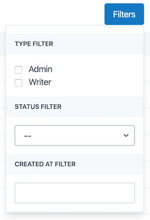
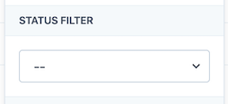
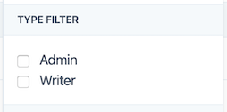
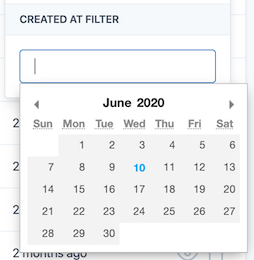
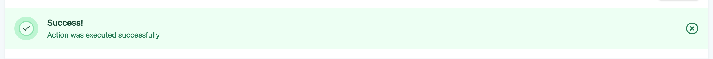
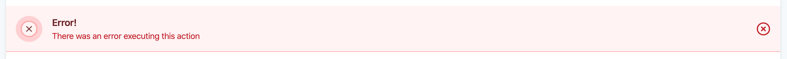

# Table view

This view creates a dinamic data table, you can customize the headers, the data to be displayed for each row, add a search input, filters and actions

- [Laravel views](../README.md)
- [Table view](#table-view)
    - [Create new table view](#create-new-table-view)
    - [Defining initial data](#defining-initial-data)
    - [Headers](#headers)
    - [Rows](#rows)
    - [Searching data](#searching-data)
    - [Pagination](#pagination)
- [Filters](#filters)
    - [Select filter](#select-filter)
    - [Boolean filter](#boolean-filter)
    - [Date filter](#date-filter)
    - [Registering filters](#registering-filters)
    - [Changing title](#changing-title)
- [Actions](#actions)
    - [Registering actions](#registering-actions)
    - [Redirect action](#redirect-action)
    - [Showing alert messages](#showing-alert-messages)
- [Showing UI components](#showing-ui-components)
    - [Avatar](#avatar)
    - [Badges](#badges)

## Table View example


## Create new table view
```bash
php artisan make:table-view UsersTableView
```
With this artisan command a UsersTableView.php file will be created inside `app/Livewire` directory, this this class you can customize the behavior of the table view.

## Defining initial data
Return an `Eloquent` query with the initial data to be displayed on the table, it is important to return the query, not the data collection.
```php
use App\User;

public function repository(): Builder
{
    return User::query();
}
```

## Headers
Return an array with all the headers you need
```php
public function headers(): array
{
    return ['Name', 'Email' 'Created', 'Updated'];
}
```

## Rows
Return an array with all the data you need for each row, this method receives an model instance for every row in the database according with the initial query and the filters activated.
```php
public function row($model)
{
    return [$model->name, $model->email, $model->created_at, $model->updated_at];
}
```

## Searching data
You can enable a search input specifying a class property with the fields you want to search by
```php
public $searchBy = ['name', 'email'];
```
When this property is configured, a search input is showed at the top left of the table

## Pagination
The data is paginated by default showing 20 elements per page, you can customize this behavior with class property
```php
protected $paginate = 50;
```

# Filters
You can add features to filter the table data, when a filter is configured a button is showd at the top right of the table. These filters are created inside `app` directory and you can user any namespace you want.



## Select filter

The most common filter, allow the user to choose an option from a dropdown menu.



```bash
php artisan make:filter Filters/UsersActiveFilter
```
With this artisan command a `UsersActiveFilter.php` file will be created inside `app/Filters` directory, you can use any namespace you want. The select filter class created have 2 methods, `apply` and `options`, with `apply` you can modify the current query with your own business logic for this filter, with the `options` method you can define the title and the values for each option
```php
class UsersActiveFilter extends Filter
{
    public function apply(Builder $query, $value, $request)
    {
        return $query->where('active', $value);
    }

    public function options()
    {
        return [
            'Active' => 1,
            'Disabled' => 0,
        ];
    }
}
```
The `apply` method receives que current `$query`, the `$value` selected by the user (defined in the `options` method) and the current `$request`, it should return the modified query

## Boolean filter
This filter allows the user to choose multiple options from a list of input check boxes



```bash
php artisan make:filter Filters/UsersTypeFilter --type=boolean
```

Same as select filter, the boolean filter have 2 methods, `apply` and `options`, with the `apply` method you can modify the current query with your own business logic for this filter, and with the `options` method you can define the title and the value for each option.

```php
class UsersTypeFilter extends BooleanFilter
{
    public function apply(Builder $query, $value, $request)
    {
        // $value['admin'] = true/false
        if ($value['admin']) {
            $query->where('is_admin', true);
        }
        // $value['writer'] = true/false
        if ($value['writer']) {
            $query->where('is_writer', true)
        }
        return $query;
    }

    public function options()
    {
        return [
            'Administrator' => 'admin',
            'Writer' => 'writer',
        ];
    }
}
```
In this case the `apply` method receives the current `$query` and an associative array with the boolean value for each of the options defined and the current `$request`, it should return the modified query

## Date filter

The date filter allows the user select the value by a date picker



```bash
php artisan make:filter Filters/CreatedFilter --type=date
```

The date filter only have the `apply` method, with this method you can modify the current query with your own business logic for this filter

```php
class CreatedFilter extends DateFilter
{
    public function apply(Builder $query, Carbon $value, $request)
    {
        // $query->where('', $value);
    }
}
```

In this case the `apply` method receives the currenct `$query` and the value selected by the user, this value is a `Carbon` instance of the date, it should return the modified query.

## Registering filters
You can register all the filters you want in the `TableView` class defining a `filters` method with all the filters you want to use

```php
protected function filters()
{
    return [
        new UsersActiveFilter,
        new CreatedFilter,
        new UsersTypeFilter
    ];
}
```

## Changing title
You can customize the title of the filter adding a public property `$title` with the title you want

```php
public $title =  "My custom title";
```

# Actions
You can define actions to be executed in every row when a user clicks on a button, these actions are created inside `app` directory and you can user any namespace you want.

```bash
php artisan make:action Actions/ActivateUserAction
```

With this artisan command a `ActivateUserAction.php` file will be created inside `app/Actions` directory, you can use any namespace you want. With this class you can customize how the action should behave, it has 2 public properties to customize the title and the icon, it is important specify a valid [Feather icon](https://feathericons.com/) name, the `handle` method receives the model corresponding to the row where the action was executed, you can write your own business login inside this method

```php
class ActivateUserAction extends Action
{
    public $title = "Activate user";

    public $icon = "unlock";

    public function handle($model)
    {
        $model->active = true;
        $model->save();
    }
}
```

## Registering actions
You can register all the actions you want in the `TableView` class defining a `actionsByRow` method with all the actions you want to use

```php
protected function actionsByRow()
{
    return [
        new ActivateUserAction,
    ];
}
```

## Redirect action
This package has a defined action to redirect the user to a named route related to your model inside your project when the button is clicked, you can use it directly on the `actionsByRow` method

```php
protected function actionsByRow()
{
    return [
        // Will redirect to route('user', $user->id)
        new RedirectAction('user', 'See user', 'eye'),
    ];
}
```

The first param is the name of the route to be redirected, it is important to be a named route, the `RedirectAction` will inject the model id to that route

## Showing alert messages
To display a success alert message you can execute the `$this->succes()` at the end of the handle method, a default message will be displayed once the action is executed



```php
public function handle($model)
{
    $model->active = true;
    $model->save();

    $this->success();
}
```
You can customize the message passing it as a param
```php
$this->success('My custom message');
```

To display an error message just execute `error` instead of `success`
```php
$this->error();
```



# Showing UI components
You can display some UI components instead of plain text like avateres or badges

## Avatar
Show an 32x32 rounded image

```php
use Gustavinho\LaravelViews\Facades\UI

public function row($model)
{
    return [
        UI::avatar($model->avatar_url)
    ];
}
```

## Badges
Shows a colored badge with a text, it is gray by default

```php
UI::badge('My title');
UI::badge('My title', 'info');
UI::badge('My title', 'success');
UI::badge('My title', 'warning');
UI::badge('My title', 'danger');
```